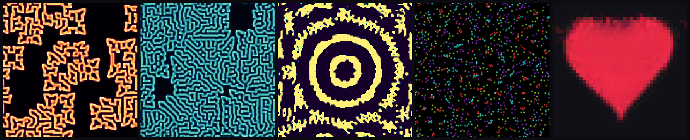
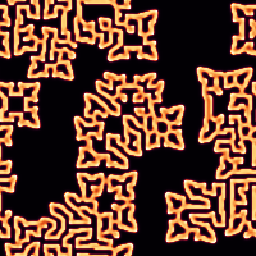
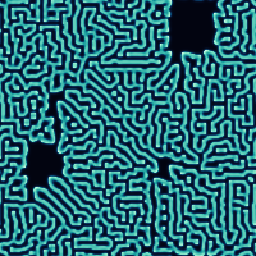
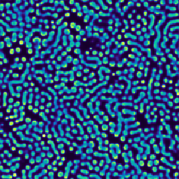
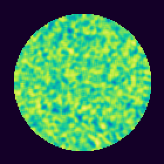
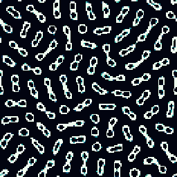
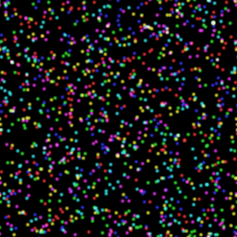
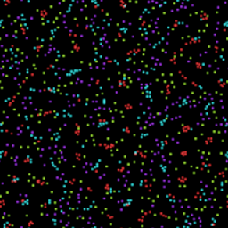
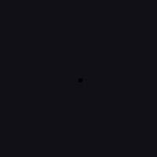

<div align="center">

# emergent

### intelligence is what simple local rules do at scale

*A tiny PyTorch framework where a universe is nothing more than a **rule** iterated over a **state**.
Hand-write the rule and you get artificial life. **Learn** the rule and global form emerges from
purely local computation — a colony of identical cells that grows a shape and heals when you cut it.*



</div>

---

## The whole idea on one screen

There is exactly one abstraction. A **`Rule`** is the physics of a world; it knows how to seed a
state, advance it one tick of *local* computation, and paint it. A **`Universe`** just turns the crank.

```python
from emergent import make
from emergent.render import save_animation

uni = make("lenia", preset="geminium")     # a continuous cellular automaton
frames = uni.record(steps=320, every=2, scale=3)
save_animation(frames, "lenia.gif", fps=30)
```

```python
class Rule(nn.Module):
    def init_state(self): ...   # conjure an initial state
    def step(self, state): ...  # advance it by one local update
    def render(self, state): .. # paint it as an RGB frame
```

Because a `Rule` is a `torch.nn.Module`, hand-written rules keep their kernels as **buffers** (Lenia,
Gray–Scott, Particle Life) and the learned rule keeps its weights as **parameters** (Neural CA). The
*same* machinery runs every world, on CPU here and on a GPU the moment one appears.

---

## Four faces of emergence

| World | Substrate | The "simple rule" | What emerges |
|---|---|---|---|
| **Gray–Scott** | two chemical fields | reaction + diffusion (`f`, `k`) | Turing patterns: coral, fingerprints, spirals |
| **Lenia** | a continuous field in `[0,1]` | one kernel + one growth curve | self-sustaining *life-forms* |
| **Particle Life** | N particles, K species | a K×K attraction matrix | cells, membranes, whole ecologies |
| **Neural CA** ⭐ | a 16-channel grid | a **learned** ~6k-param local rule | **morphogenesis & self-repair** |

### Gray–Scott — patterns from two reagents
Two chemicals diffuse at different rates while `U + 2V → 3V` quietly burns:

$$\dot U = D_u\,\nabla^2 U - UV^2 + f(1-U), \qquad \dot V = D_v\,\nabla^2 V + UV^2 - (f+k)V$$

The Laplacian is a single convolution over a wrap-around world. Two numbers `(f, k)` decide whether you
get coral, mazes, fingerprints or spirals.

<div align="center">



</div>

### Lenia — Conway's Life, made continuous
Where Conway counts live neighbours on a binary grid, Lenia convolves a *smooth* field with a soft
radial kernel `K` and nudges each cell toward a target neighbourhood density via a bell-shaped growth map:

$$U = K * A, \qquad A \leftarrow \mathrm{clip}\big(A + \mathrm{d}t\,G(U),\,0,\,1\big), \qquad G(u) = 2e^{-(u-\mu)^2/2\sigma^2} - 1$$

Out of noise, gliders and lifelike "creatures" condense and swim.

<div align="center">


</div>

### Particle Life — an ecology in a matrix
Every particle has a species. The *entire* rule is a `K×K` matrix: `A[i,j]` is how strongly species `i`
is drawn to (or repelled by) species `j` nearby. Below a hard core, everything repels (so matter never
collapses). From those two lines, cells with membranes, chasers and self-replicating blobs appear —
none of it written down anywhere but the matrix.

<div align="center">


</div>

### Neural CA — a rule that *learns* to build, and to heal
This is the centerpiece. Each cell is a 16-vector (the first four channels are the visible RGBA, the
rest are hidden state). At every tick a cell perceives its 3×3 neighbourhood through fixed Sobel
filters, runs the result through a **tiny shared network** (two 1×1 convolutions, ~6k weights),
**stochastically** adds the update to itself, and dies if it has no living neighbours.

The network is *identical in every cell* and only ever sees its neighbours. Yet trained against a target
image — with a persistent sample pool and random damage thrown in — it learns to **grow** that image
from a single seed and to **regenerate** it after you tear pieces away. Local rule in; global, robust
intelligence out.

<div align="center">



*grow from one cell → fully formed → amputated → regrown*
</div>

---

## Quickstart

```bash
pip install -e .          # or: pip install -r requirements.txt
```

```bash
# run any world straight to a GIF / MP4 (extension decides the format)
emergent lenia --preset geminium --steps 320 --scale 3 --out lenia.gif
emergent gray-scott --preset spirals --steps 500 --out coral.mp4
emergent particle-life --preset ecology --steps 400 --out life.gif

# tweak any rule parameter on the fly
emergent lenia --set mu=0.15 --set sigma=0.016 --set betas=1,0.5,0.3

# the centerpiece: learn a rule, then watch it grow and heal
emergent neural-ca train --target ladybug --out checkpoints/ladybug.pt
emergent neural-ca grow  --ckpt checkpoints/ladybug.pt --damage --out regen.gif

# render the whole curated gallery
emergent gallery --out gallery
emergent worlds          # list worlds + presets
```

Python API:

```python
from emergent import make
from emergent.worlds.neural_ca import train_nca

uni = make("particle-life", preset="cells", seed=3)
uni.step(400)
frame = uni.rule.render(uni.state)            # (H, W, 3) uint8

model, history = train_nca("heart", iters=1500)   # learn a local rule
```

---

## How the Neural CA learns (the interesting part)

Training uses the **sample-pool** trick from Mordvintsev et al. so the rule is robust, not just correct
once:

1. keep a pool of grids; most batches **continue** a previous rollout (teaches *persistence* — don't
   overshoot and dissolve),
2. each step the **worst** sample is reset to a single seed (teaches *growth from scratch*),
3. a few well-grown samples are **damaged** before the rollout (teaches *regeneration*),
4. roll out 48–64 ticks, take L2 to the target RGBA, backprop through time, and **normalise the
   gradients** per-tensor for stability.

The result generalises far past the training horizon: the organism reaches its target shape and then
*holds* it, and re-grows missing pieces it never saw removed during that particular rollout.

---

## Project layout

```
emergent/
├── core/            the substrate-independent machinery
│   ├── rule.py        Rule  — init_state / step / render  (an nn.Module)
│   ├── universe.py    Universe — iterates a rule, streams frames
│   └── device.py      device-agnostic helpers (CPU / CUDA / MPS)
├── worlds/
│   ├── gray_scott.py    reaction–diffusion
│   ├── lenia.py         continuous cellular automaton
│   ├── particle_life.py particle ecologies
│   ├── neural_ca.py     the learned, self-healing rule  ⭐
│   └── targets.py       procedural RGBA shapes to grow
├── render/            palettes (no matplotlib), painter, GIF/MP4 recorder
└── cli.py             `emergent ...`
```

Design choices worth noting: rendering is **matplotlib-free** (palettes are 256-entry LUTs built from
anchor colours); everything is **device-agnostic**; every world exposes named `presets`; and the frame
stream is a generator, so a few hundred steps go straight to disk without ever holding the whole film in
memory.

---

## Tests

```bash
pytest -q
```

Fast, deterministic checks on tiny grids: core time-stepping, every palette and the recorder
(GIF + MP4 + PNG), invariants per world (Gray–Scott stays in `[0,1]`, Lenia bounded, particles stay on
the torus, particle count conserved), the Neural CA seed/step/damage, that `fit` actually reduces loss,
and a full checkpoint round-trip.

---

## References & lineage

- **Lenia** — Bert Wang-Chak Chan, *Lenia: Biology of Artificial Life* (2019).
- **Growing Neural Cellular Automata** — Mordvintsev, Randazzo, Niklasson & Levin, *Distill* (2020).
- **Gray–Scott** — Pearson, *Complex Patterns in a Simple System*, *Science* (1993).
- **Particle Life** — Clusters / particle-interaction life (Ventrella; Mohr), here as a vectorised torch port.

## License

MIT.
